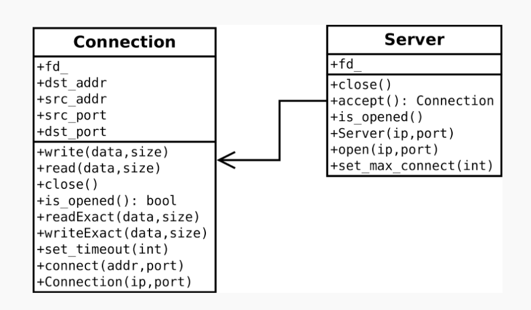

# Homework 3

## Task

Создать библиотеку с именем **tcp**.

Функционал библиотеки должен позволять создавать и принимать соединения по протоколу tcp/ipv4.

Подключение, чтение и запись должны обладать опциональным параметром таймаута.

Библиотека должна гарантировать базовую безопасность исключений и соответствовать диаграмме классов

## Class diagram

## Implementation progress

- [ ] Server
- [ ] Connection
- [ ] Exceptions
- [ ] Tests
